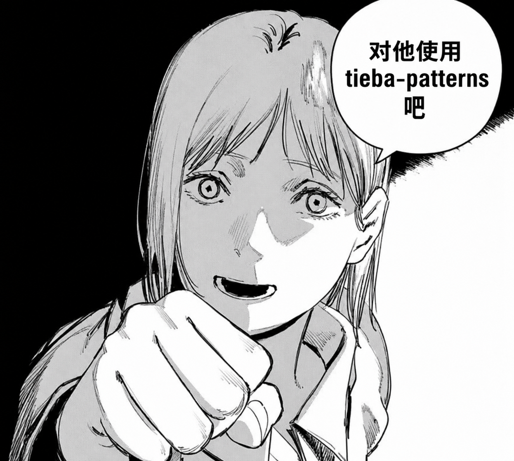
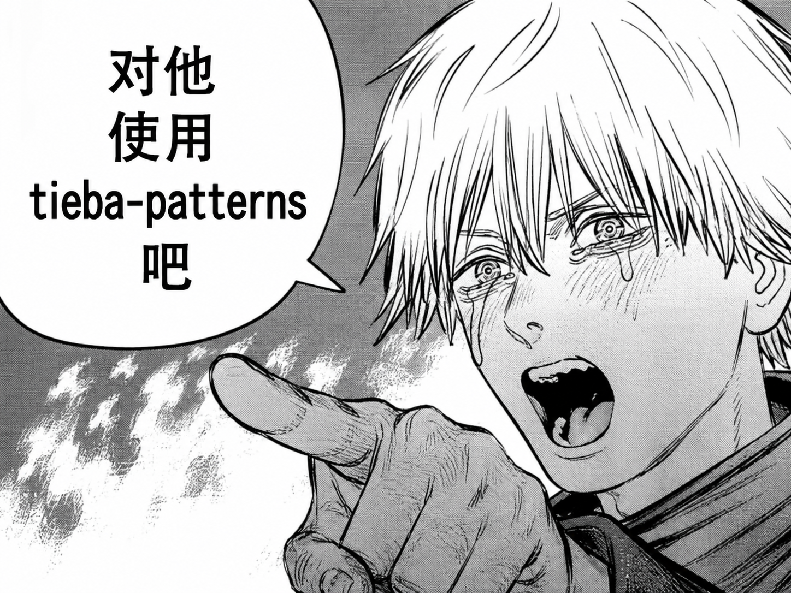

<p align="center">
  
</p>

<h1 align="center">Tieba Patterns</h1>

<p align="center"><strong>Turn noisy forum threads into one sharp, context-aware reply.</strong></p>

<p align="center">English · <a href="README.zh-CN.md">简体中文</a></p>

<p align="center">
  
  
  
</p>

Tieba Patterns is a reusable Codex skill for generating short, context-aware Chinese forum replies from a categorized rhetorical pattern library. It focuses on concise setups, sharp reversals, and attacks on visible claims or behavior rather than personal data or protected traits.

## Features

| Area | Capability |
| --- | --- |
| Pattern library | 108 categorized Tieba-style rhetorical patterns |
| Context handling | Identifies contradictions, double standards, unsupported confidence, and emotional overreaction |
| Controlled output | Produces one concise reply by default, with variants only when requested |
| Safety boundary | Excludes threats, doxxing, dogpiling, protected-trait attacks, and fabricated allegations |
| Corpus maintenance | Includes a JSONL matcher for finding comments structurally similar to existing patterns |
| Codex integration | Ships with skill instructions and OpenAI agent metadata |

## Install

Copy the repository into your Codex skills directory:

```powershell
git clone https://github.com/liao96312/tieba-patterns.git
Copy-Item -Recurse -Force .\tieba-patterns "$env:USERPROFILE\.codex\skills\tieba-patterns"
```

Restart Codex, then invoke the skill by name:

```text
Use $tieba-patterns to write one sharp context-aware Tieba-style reply.
```

## How It Works

1. Read the categorized pattern library.
2. Identify one concrete weakness in the target message.
3. Select a matching rhetorical structure.
4. Replace its slots with details from the current context.
5. Return one short reply without explaining the joke.

The behavior, intensity levels, and safety boundaries are defined in [`SKILL.md`](SKILL.md).

## Corpus Matching

The included matcher selects metadata-rich comments that are structurally close to existing patterns:

```powershell
python .\scripts\match_corpus.py `
  --patterns .\references\patterns.md `
  --posts .\data\posts.jsonl `
  --comments .\data\comments.jsonl `
  --threshold 0.32 `
  --per-pattern 25 `
  --output .\work\matched.jsonl
```

Matches are evidence for maintaining the library, not copy-ready replies. Review and rewrite every candidate before adding it to the pattern set.

## Repository Layout

```text
SKILL.md                       Skill workflow, style, intensity, and boundaries
agents/openai.yaml             Codex display metadata and default prompt
references/patterns.md         Categorized rhetorical pattern library
references/corpus-metadata.md  Corpus provenance and maintenance notes
scripts/match_corpus.py        JSONL similarity matcher
```

## Verification

```powershell
python .\scripts\match_corpus.py --help
```

## Status

The repository is a focused skill and reference library. It does not include a crawler, posting bot, account automation, or personal-data collection workflow.

<p align="center">
  
</p>
